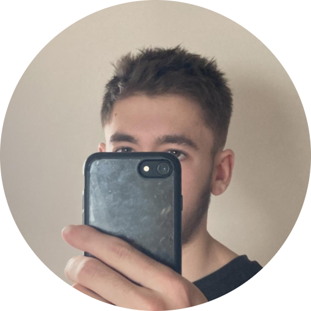

# 
Hey there! I'm Adam.

I'm a French essentially web developer, but also a songwriter/singer. 

I make things that sometimes work.

I'm currently working on a few projects, including new songs and [NekoViewer](https://git.classydev.fr/Adam/nekoviewer).

I'm always looking to collaborate on new or existing projects, so feel free to contact me!

Currently, a student at [Simone-Veil](https://lycee-simone-veil-liffre.ac-rennes.fr/) high school.

## 📫 How to reach me

- Email: [contact@classydev.fr](mailto:contact@classydev.fr)
- Contact form: [classydev.fr](https://classydev.fr/#contact)

## ⚡ Skills

- **Languages**: `HTML`, `CSS`, `JavaScript`, `TypeScript`, `Python`, `Java`.
- **Frameworks**: `Nuxt`, `Vue`, `Express`.
- **Tools**: `Git`, `Docker`.
- **Other**: `Songwriting`, `Singing`, `Guitar`, `Piano`, `Producing`.

## 📋 Current projects

- [NekoViewer](https://git.classydev.fr/Adam/nekoviewer): A cross-platform and soon-to-be cross-device manga reader.
- [Website](https://classydev.fr): My personal website.
- [Music](https://music.classydev.fr): My personal music website, where I post my songs.
- [NekoNya](https://github.com/NekoNyaDevs): An anime-themed website, with a few features such as an image API.

*Thank you for reading this README, have a great day!*
